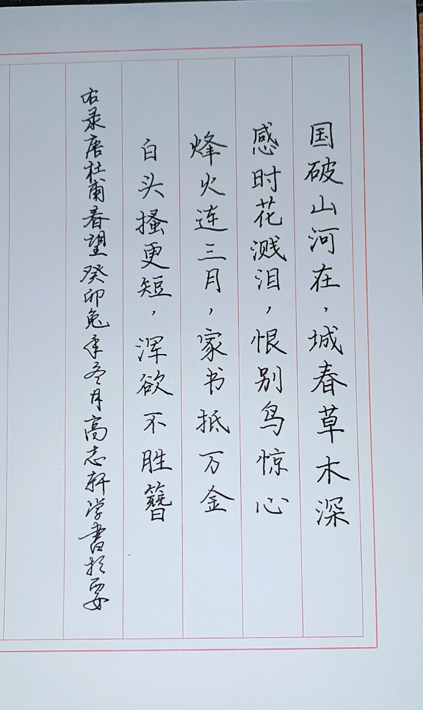

## “一气通贯杯”立直麻将邀请赛章程

---

#### 赛事名称

“一气通贯杯”立直麻将邀请赛

#### 主办单位

中水平棋牌俱乐部

---

#### 赛程

##### 初赛

$12$名选手分为$A$、$B$、$C$三桌，每桌进行四个半庄的比赛，各桌前两名晋级半决赛。上届冠军$\text{Leo638}$选手、亚军选手$\text{Runazar}$直接晋级半决赛。

##### 半决赛

$8$名选手分为$A$、$B$两桌，每桌进行六个半庄的比赛，各桌前两名晋级决赛。

##### 决赛

决赛共进行八个半庄的比赛。

---

##### 初步时间安排：

- 初赛：0615～0616

- 半决赛：0621～0623

- 决赛：0629～0707

*具体赛程可能根据实际报名人数及选手们个人情况变动。*

---

#### 细节

- 本次比赛平台为雀魂，报名之前请完成账号注册，**<u>请牢记您的账号和密码</u>**，并熟悉平台的基本操作。如果您之前从未接触过立直麻将，建议您完成几局铜之间·四人东对局，认识一下基本的役种（如立直、断幺九、平和等）。您可通过手机客户端、电脑客户端、网页版参赛，各渠道链接如下：
  
  - 雀魂网页版（建议使用EDGE浏览器打开）：https://game.maj-soul.com/1/
  
  - 雀魂手机端APP：www.maj-soul.com
  
  - 雀魂电脑端steam（在steam中搜索“雀魂麻将”即可）：https://store.steampowered.com/app/1329410/MahjongSoul/

- 每桌任意选手均可创建四麻半庄战房间，并邀请其他选手加入。注意设置应当与下面“比赛规则”部分所述相同（正常情况下无需对设置进行额外调整）。

- 选手迟到$10$分钟后取消当局比赛资格，由普通难度的电脑代替。

- 每局比赛后由当桌顺位最高的选手向主办方提供牌谱链接，并汇报比赛结果。

- 本次比赛娱乐属性远大于竞技属性。

---

#### 比赛规则

- 起始点数：$25000$

- 一位必要点数：$30000$，$\text{ALL LAST}$结束时一位不足则西入

- 无古役

- 有$3$张赤宝牌

- 有食断（允许断幺九副露）

- 长考时间为$5+20$秒

- 有九种九牌、四杠散了、四风连打、四家立直流局

- 有击飞

- $\text{ALL LAST}$结束庄家一位不连庄

- 顺位分：1位+45，2位+5，3位-15，4位-35

---

#### 成就

在一个半庄中，每达成以下一项成就，在结算完毕顺位之后，该半庄最终得分+5。每个半庄每个成就仅计算一次。

- 天赋异禀：起手平均向听数最少且低于$3$。

- 振听👑：振听状态下和牌。

- 无役👑：没有手役的状态下和牌，如仅靠河底捞鱼、海底摸月、岭上开花、枪杠和牌。

- 天选之人：和出役满（不包括累计役满，但包括古役役满，如大竹林、石上三年等）。

- 朵拉战神：单次和牌时使用至少$10$张宝牌（包括表里红宝牌）。

- 我爱截胡：和牌不超过两番，同时同桌存在其他人役满听牌（役满机会即可，包括累计役满。计自摸，不计一发、里宝牌。）

- 真闹麻了：在一个半庄中所有和牌均不超过两番并且最终取得一位。

- 点棒小偷：在一个半庄中获取的场供和罚符多于和牌点数并最终取得一位。

- 悬赏役种：首次和出本届赛事悬赏役种“一气通贯”。（以主办方收到截图的时间为准，可与彩蛋叠加）

---

#### 彩蛋

在一个半庄中，每触发一次彩蛋，在结算完毕顺位之后，该半庄最终得分+1。每个半庄可触发多次彩蛋。

- 悬赏役种：和出本届赛事悬赏役种“一气通贯”。
  
  > 一二三，爬上山；四五六，翻筋斗；七八九，拍皮球。

- 更重量级：直击$\text{炸胡集训队}$选手$2000$点
  
  > 笑得像个二百斤的胖子.jpg

- 快过年了：直击$\text{玩物丧志。}$选手跳满及以上
  
  > 过年了当然要放炮，您听这炮多响！

- 建议弃和：被$\text{谪仙对影捞玉蟾}$选手一发放铳
  
  > 防守？防个P！凭什么我弃？对攻！

- 小丑退散：直击$\text{车棚兄弟}$选手1500点（必须捉炮，不计流局罚符）
  
  > 埃鸭，这就是您的理解吗？

- 多多指教：连续直击$\text{Runazar}$选手（连续直击$k$次，计触发彩蛋$k-1$次）
  
  > 前辈！请指导我！请再多指导我一些吧！

- 当年之勇：击飞$\text{Leo638}$选手
  
  > 虚名何足夸口？败吾休得再提！

---

#### 奖项

- 第一名：雀魂月势御守90天（可折现）

- 第二名：雀魂月势御守60天（可折现）

- 第三名：雀魂月势御守30天（可折现）

- 八强选手均会收到高先生（$\text{车棚兄弟}$选手）的书法作品一幅，样品如下：

---

*如果您对赛事有任何建议，欢迎联系我们。*

*@落墨    联系方式：QQ903850177*

---

##### 往届赛事

[“无役杯”立直麻将锦标赛](https://github.com/KazoeYakuman/muyaku)

---
